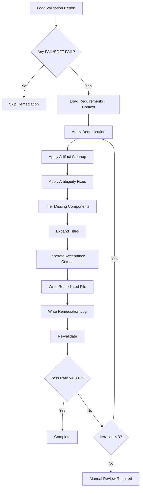

# Intelligent Remediation Skill

## Purpose
Apply context-aware fixes to requirements and test cases, using the project context document to infer missing information.

## When to Invoke
Use this skill when:
- Validation results show FAIL or SOFT-FAIL
- User requests remediation
- During automated remediation cycles
- Before human review to pre-fix obvious issues

## Remediation Strategies

### 1. Duplicate Resolution
**Detection:** Requirements with >80% text similarity in descriptions

**Resolution Strategy:**
1. Identify the primary requirement (earliest ID or most complete)
2. Merge source references from all duplicates
3. Combine any unique details from duplicates into primary
4. Mark duplicates for removal
5. Update traceability to point to primary

**Example:**
```
Before:
- JOVI-FUNC-012: "System shall provide High Availability..." (Source: Doc A)
- JOVI-FUNC-020: "System shall provide High Availability..." (Source: Doc B)
- JOVI-FUNC-028: "System shall provide High Availability..." (Source: Doc C)

After:
- JOVI-FUNC-012: "System shall provide High Availability..." 
  (Source: Doc A; Doc B; Doc C)
  [JOVI-FUNC-020 and JOVI-FUNC-028 removed as duplicates]
```

### 2. Ambiguity Clarification
**Detection:** Presence of ambiguous terms

**Resolution Strategy:**
1. Identify the ambiguous term
2. Search context document for specific values
3. If found, replace with specific value
4. If not found, mark as [TBD - specify {metric}]

**Transformation Patterns:**
| Ambiguous | Context Clue | Specific |
|-----------|--------------|----------|
| "fast" | "10-second SLA" in context | "within 10 seconds" |
| "secure" | "TLS 1.3" mentioned | "encrypted using TLS 1.3" |
| "available" | "99.9% uptime" in context | "99.9% availability" |
| "robust" | retry mentioned | "with retry mechanism (max 3 attempts)" |

### 3. Missing Component Inference
**Detection:** Components field is empty or "TBD"

**Resolution Strategy:**
1. Parse description for component keywords
2. Match against known component list
3. Check context document for component associations
4. Assign most likely component(s)

**Component Keywords:**
```python
COMPONENT_PATTERNS = {
    "BeJoviIncomingApi": ["incoming", "pacs.008 validation", "jovi.*incoming"],
    "BeJoviOutgoingApi": ["outgoing", "initiation", "jovi.*outgoing"],
    "OVI Mainframe": ["ovi", "mainframe", "copybook", "ovi154"],
    "Cassandra DB": ["cassandra", "database", "persist", "store"],
    "Kafka": ["kafka", "sage", "message queue"],
    "Screening": ["screening", "fircosoft", "hit"],
    "FI Gateway": ["fi gateway", "ing-fi", "fi api"],
}
```

### 4. Title Expansion
**Detection:** Title < 20 characters or too generic

**Resolution Strategy:**
1. Extract key action verb from description
2. Extract key object/entity
3. Combine into descriptive title

**Example:**
```
Before: "with Validation"
Description: "System shall validate incoming pacs.008 messages..."
After: "Validate Incoming pacs.008 Messages"
```

### 5. Artifact Cleanup
**Detection:** Markdown syntax, image references, table fragments

**Patterns to Remove:**
- `` - Image references
- `## Page X` - Page markers
- `| | | |` - Empty table cells
- `**Dependencies:**` - Formatting artifacts
- Trailing numbers like `3.3` or `2.1.4`

### 6. Acceptance Criteria Generation
**Detection:** Missing or vague acceptance criteria

**Resolution Strategy:**
1. Analyze requirement type
2. Apply domain-specific template
3. Generate Given/When/Then format

**Templates by Type:**
```
VALIDATION:
Given a {message_type} message with {condition}
When the validation endpoint processes it
Then the system shall return {expected_response}

ERROR_HANDLING:
Given a {error_scenario} occurs
When the system detects the error
Then the system shall {log/retry/reject} and return {error_code}

INTEGRATION:
Given system A sends {request_type} to system B
When system B processes the request within {SLA}
Then system A receives {response_type} confirmation
```

## Remediation Workflow



## Output
- Updated requirements/test cases file
- Detailed remediation log with before/after for each change
- Summary statistics (changes made, issues remaining)
