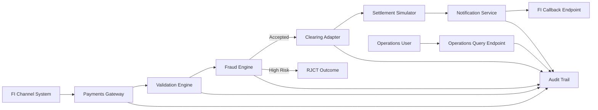

# SAMPLE_IP - Comprehensive Context Document

**Generated:** 2026-07-28T13:43:59.9298714+02:00  
**Domain:** Core Banking/Payments  
**Source Documents:** 1  
**Images Analyzed:** 0

---

## 1. Executive Summary
SAMPLE_IP is an instant payments platform for participating Financial Institutions (FIs) that processes SEPA Instant Credit Transfer transactions in near real-time. The platform uses ISO 20022 payment messaging, enforces layered validation and fraud controls, and supports both synchronous acknowledgement and asynchronous final-status notification.

The system is designed for operational resilience and speed, with explicit goals of sub-10-second end-to-end processing for 95th percentile transactions, 99.95% monthly availability, and sustained throughput of at least 250 transactions per second. It also includes immutable auditability so every payment lifecycle event can be reconstructed for operational review, compliance, and incident analysis.

From a quality and testing perspective, the implementation center of gravity is correctness and timeliness across API intake, validation, fraud decisioning, clearing handoff, callbacks, and traceability. High-value test scope includes duplicate controls, schema and auth failures, fraud rejection paths, callback delivery behavior, and cancellation behavior while settlement is pending.

## 2. System Overview
### 2.1 Purpose and Scope
SAMPLE_IP provides a payment initiation and lifecycle tracking capability for SCT Inst transactions. Its purpose is to receive FI-originated payment requests, validate and risk-assess them, hand them to clearing/settlement simulation, and keep all stakeholders informed through status responses, callbacks, and operations querying.

In-scope capabilities:
- Payment initiation API for FI channels (`POST /v1/payments`)
- Validation for IBAN, BIC, amount, and duplicate EndToEndId checks
- Fraud decisioning with reject outcomes (`RJCT`) for high-risk traffic
- Clearing and settlement handoff simulation
- Final status callback publication within timing targets
- Immutable audit logging for lifecycle events
- Operations status retrieval by EndToEndId
- Cancellation support (`camt.056`) for pending-settlement transactions

Out-of-scope capabilities:
- Card payment rails
- Foreign exchange conversion

### 2.2 Key Stakeholders
- Participating Financial Institutions (FIs): Submit payments and receive callbacks.
- Payments Platform Team: Own platform implementation and runtime health.
- Operations Users: Monitor and investigate transactions.
- Risk/Fraud Teams: Define and monitor fraud controls and outcomes.
- Audit/Compliance Stakeholders: Consume lifecycle traceability and evidence.

### 2.3 Domain Context
The platform sits in Core Banking/Payments, specifically SCT Inst processing. Core terms include ISO 20022 messages (`pacs.008`, `pacs.002`, `camt.056`), payment IDs (`messageId`, `EndToEndId`), technical acceptance (`ACTC`), and rejected outcomes (`RJCT`). Regulatory and operational expectations emphasize speed, availability, data protection, and auditability.

## 3. Architecture
### 3.1 High-Level Architecture
SAMPLE_IP follows a staged pipeline architecture:
1. API ingress and authentication at Payments Gateway.
2. Business/data validation in Validation Engine.
3. Risk evaluation in Fraud Engine.
4. Clearing submission via Clearing Adapter.
5. Event publication via Notification Service.
6. Immutable evidence capture in Audit Trail.

### 3.2 Components
- **FI Channel System**
  - Purpose: Originates payment initiation and receives final callbacks.
  - Responsibilities: Build valid requests, authenticate, handle async statuses.
  - Interfaces: REST API consumer, callback endpoint provider.
  - Dependencies: OAuth2 credentials, stable network connectivity.

- **Payments Gateway**
  - Purpose: Entry point for payment initiation requests.
  - Responsibilities: Auth checks, schema checks, request acceptance, routing.
  - Interfaces: `POST /v1/payments`.
  - Dependencies: OAuth2 trust configuration, TLS termination.

- **Validation Engine**
  - Purpose: Enforce syntactic and business validation.
  - Responsibilities: IBAN validation (ISO 13616), BIC format checks, amount limit checks, duplicate EndToEndId check over 48h.
  - Interfaces: Internal service calls from gateway.
  - Dependencies: Validation ruleset, duplicate-check store.

- **Fraud Engine**
  - Purpose: Evaluate transaction risk.
  - Responsibilities: Score/flag transactions, block high-risk transactions with `RJCT`.
  - Interfaces: Internal service decision API.
  - Dependencies: Fraud reference data, scoring logic.

- **Clearing Adapter**
  - Purpose: Submit accepted transactions to settlement simulation.
  - Responsibilities: Contract translation and handoff to clearing/simulator.
  - Interfaces: Internal adapter API and settlement simulator contract.
  - Dependencies: Message contract compatibility.

- **Notification Service**
  - Purpose: Inform FIs of final transaction outcomes.
  - Responsibilities: Callback publishing within 5 seconds of settlement response, delivery handling.
  - Interfaces: FI callback HTTP endpoints.
  - Dependencies: FI endpoint reliability, retry strategy.

- **Audit Trail Store**
  - Purpose: Preserve immutable payment lifecycle evidence.
  - Responsibilities: Persist timestamp, actor, decision, reason per event.
  - Interfaces: Write from all processing stages, read for ops queries.
  - Dependencies: Durable storage and retention policies.

- **Operations Query Endpoint**
  - Purpose: Enable status lookups by EndToEndId.
  - Responsibilities: Retrieve transaction timeline/status.
  - Interfaces: Ops API endpoint.
  - Dependencies: Audit and status index availability.

### 3.3 Integration Points
- FI -> Payments Gateway: REST over TLS 1.2+ with OAuth2 client credentials.
- Internal services: Gateway to Validation, Fraud, Clearing through service interfaces.
- Clearing Adapter -> Settlement Simulator: Contracted handoff for settlement lifecycle.
- Notification Service -> FI Callback Endpoint: Asynchronous status callbacks.
- Operations User -> Query Endpoint: Status retrieval by EndToEndId.

### 3.4 Data Flows
- Initiation flow: FI request -> Gateway -> Validation -> Fraud -> Clearing.
- Status flow: Gateway returns sync acknowledgment (`ACTC` for valid accepted tech checks).
- Finalization flow: Settlement response -> Notification Service -> FI callback.
- Evidence flow: Each stage emits immutable audit events.
- Operations flow: Query endpoint reads status/audit timeline by EndToEndId.

## 4. Business Processes
### 4.1 Primary Flows
- **Process: Payment Initiation and Acceptance**
  - Trigger: FI calls `POST /v1/payments`.
  - Steps:
    1. Gateway authenticates OAuth2 credentials.
    2. Gateway validates request schema and basic format.
    3. Validation Engine checks IBAN, BIC, amount, uniqueness.
    4. Fraud Engine scores transaction.
    5. If accepted, transaction is handed to Clearing Adapter.
    6. System returns synchronous status response for valid requests (target within 2s).
  - Decision Points:
    - Auth fail -> HTTP 401.
    - Validation fail -> reject with machine-readable code.
    - Duplicate EndToEndId in 48h -> reject duplicate.
    - High fraud risk -> `RJCT`.
  - Expected Outcome: Valid low-risk payment continues to settlement.
  - Error Handling: Structured error responses with code + description.

- **Process: Settlement and Final Notification**
  - Trigger: Clearing receives settlement response.
  - Steps:
    1. Clearing Adapter receives settlement outcome.
    2. Notification Service publishes callback.
    3. FI endpoint receives final status update.
    4. Audit trail records all transitions.
  - Decision Points:
    - Callback endpoint unavailable -> retry/failure handling path.
  - Expected Outcome: Final status delivered within 5s of settlement response.
  - Error Handling: Delivery failure should be retried and logged.

- **Process: Pending Cancellation (camt.056)**
  - Trigger: Cancellation request for pending-settlement transaction.
  - Steps:
    1. Cancellation request is validated.
    2. Pending state is verified.
    3. Cancellation is processed according to settlement state.
  - Decision Points:
    - Not pending -> cancellation not allowed.
  - Expected Outcome: Allowed only when payment is still pending settlement.
  - Error Handling: Explicit rejection reason when state invalid.

- **Process: Operations Status Inquiry**
  - Trigger: Operations user queries by EndToEndId.
  - Steps:
    1. Query endpoint receives lookup request.
    2. System retrieves latest status and event history.
  - Decision Points:
    - Unknown EndToEndId -> not found response.
  - Expected Outcome: Fast and accurate status visibility.
  - Error Handling: Consistent query error semantics.

### 4.2 Exception Flows
- Unauthorized access (missing/invalid OAuth2) -> HTTP 401.
- Invalid IBAN/BIC/amount -> validation rejection (`IP-VAL-002` for invalid BIC).
- Duplicate EndToEndId within 48h -> duplicate rejection.
- High-risk fraud result -> `RJCT` final outcome.
- Callback endpoint downtime -> delayed notification and retry path.

### 4.3 Timing and SLAs
- Synchronous status (`pacs.002` style response intent) for syntactically valid requests within 2 seconds.
- Final callback delivery within 5 seconds of settlement response.
- End-to-end p95 processing < 10 seconds.
- Monthly availability >= 99.95%.
- Sustained throughput >= 250 TPS.

## 5. Technical Specifications
### 5.1 APIs and Endpoints
- Endpoint: `POST /v1/payments`
- Method: `POST`
- Authentication: OAuth2 client credentials
- Transport: TLS 1.2+

Request format (JSON):
- `messageId` (string)
- `endToEndId` (string)
- `debtorIban` (string, ISO 13616 format)
- `creditorIban` (string, ISO 13616 format)
- `creditorBic` (string, BIC format)
- `amount` (number, max 100000 EUR)
- `currency` (expected `EUR` for SCT Inst)
- `requestedExecutionDateTime` (ISO 8601 UTC timestamp)

Synchronous response format (sample semantics):
- `messageId`
- `status` (e.g., `ACTC`)
- `statusReason` (e.g., `AcceptedTechnicalValidation`)
- `correlationId`

Error response expectations:
- HTTP status aligned to failure type (e.g., 401 auth failure).
- Machine-readable code + human-readable description.
- Known code: `IP-VAL-002` for invalid BIC.

Other interfaces:
- Cancellation intake for `camt.056` in pending settlement states.
- Operations status query by EndToEndId.
- FI callback endpoint for final status events.

### 5.2 Message Formats
- `pacs.008`: Payment initiation/business payload context for SCT Inst.
- `pacs.002`: Status reporting semantics used for technical/processing updates.
- `camt.056`: Cancellation request support while transaction is pending settlement.

Canonical identifiers and status signals:
- `messageId`: Request-level technical correlation.
- `EndToEndId`: Business uniqueness key with 48-hour duplicate window.
- Status examples: `ACTC` (accepted technical validation), `RJCT` (rejected).

### 5.3 Validation Rules
- OAuth2 credential presence and validity required.
- Request schema must be syntactically valid.
- Debtor and creditor IBAN must conform to ISO 13616.
- BIC format validity enforced; invalid BIC -> `IP-VAL-002`.
- Amount must be <= 100000 EUR.
- EndToEndId must be unique within rolling 48-hour period.

### 5.4 Configuration
Likely configurable parameters (implementation detail to confirm):
- Fraud threshold for high-risk classification.
- Duplicate detection window (currently 48h by requirement).
- Callback retry policy and backoff.
- SLA monitoring thresholds and alert conditions.

## 6. Data Model
### 6.1 Key Entities
- PaymentInstruction
  - messageId, endToEndId, debtorIban, creditorIban, creditorBic, amount, currency, requestedExecutionDateTime
- PaymentStatus
  - status, statusReason, correlationId, timestamps
- FraudDecision
  - riskLevel/score, decision, reason codes
- CallbackDelivery
  - destinationUrl, deliveryAttempt, result, lastAttemptAt
- AuditEvent
  - eventType, actor, decision, reason, timestamp, correlation references

### 6.2 Relationships
- One PaymentInstruction maps to one EndToEndId uniqueness context.
- One PaymentInstruction generates multiple AuditEvents across stages.
- One PaymentInstruction can produce one synchronous response and one final async callback.
- FraudDecision and ValidationOutcome determine transition to clearing or rejection.

### 6.3 Data Transformations
- FI JSON request -> validated canonical payment representation.
- Canonical payment -> fraud-evaluated decision context.
- Accepted transaction -> clearing contract payload.
- Settlement outcome -> callback status payload.
- Stage outputs -> normalized immutable audit events.

## 7. Non-Functional Requirements
### 7.1 Performance
- p95 end-to-end processing < 10 seconds.
- Synchronous technical status response within 2 seconds for syntactically valid requests.
- Final callback issuance within 5 seconds after settlement response.
- Sustained throughput target >= 250 TPS.

### 7.2 Availability
- Monthly service availability target >= 99.95%.
- Operational design implication: component redundancy and graceful degradation should be considered.

### 7.3 Security
- TLS 1.2+ for all inbound/outbound API traffic.
- AES-256 encryption for sensitive data at rest.
- OAuth2 client credentials required for payment initiation API.

### 7.4 Compliance
- Full auditability for each payment lifecycle event.
- Immutable records containing timestamp, actor, decision, and reason.
- Traceability expected from requirements to test artifacts.

## 8. Error Handling and Edge Cases
### 8.1 Error Categories
- Authentication errors (missing/invalid credentials).
- Schema/format errors (invalid structure/fields).
- Business validation errors (IBAN/BIC/amount/duplicate checks).
- Fraud rejection errors (`RJCT`).
- Integration/delivery errors (callback endpoint downtime).

### 8.2 Retry Logic
Defined requirement-level behavior:
- Callback delays are an identified risk; retries are assumed/expected for resilience.

Implementation details to confirm:
- Retry count, backoff policy, idempotency of callback dispatch.
- Dead-letter handling and operational replay process.

### 8.3 Edge Cases
- Duplicate EndToEndId at boundary of rolling 48-hour window.
- Amount exactly at limit (100000 EUR) and just above limit.
- Valid schema but high fraud score leading to `RJCT`.
- Settlement callback race conditions and delayed final statuses.
- Cancellation request arrives after transition out of pending settlement.
- Operations query for unknown or very recent EndToEndId.

## 9. Actors, Constraints, Risks, and Assumptions
### 9.1 Actor Summary
- FI Channel System: Originates payment and consumes final notifications.
- Payments Gateway: Secure intake and initial validation boundary.
- Validation Engine: Data and rule correctness gate.
- Fraud Engine: Risk control gate.
- Clearing Adapter: Settlement integration bridge.
- Notification Service: Final status propagation.
- Operations User: Runtime and incident visibility.

### 9.2 Constraints
- Domain scope is SCT Inst and defined ISO 20022 message families.
- Max supported amount is 100000 EUR.
- Duplicate suppression window fixed at 48 hours.
- Card rails and FX are explicitly out of scope.
- No image-derived architecture details available in current source set.

### 9.3 Risks
- FI callback endpoint downtime can delay final status propagation.
- Poor fraud reference data quality can increase false positives.
- Contract drift between settlement simulator and production can mask defects.
- Throughput/SLA breaches under peak load if capacity margins are insufficient.

### 9.4 Assumptions
- FI callback URLs are stable and support retries/idempotent handling.
- Settlement simulator message contracts are representative of production.
- Time synchronization across components is sufficient for SLA/audit integrity.
- Error taxonomies are consistently implemented across services.

## 10. Test-Relevant Details
### 10.1 Coverage Priorities
- API auth and transport security paths (`401`, TLS enforcement).
- Validation correctness for IBAN/BIC/amount and strict code mapping.
- Deduplication behavior across rolling 48-hour boundaries.
- Fraud rejection and reason propagation (`RJCT`).
- Sync/async timing SLAs (2s response, 5s callback, p95 < 10s).
- Audit immutability and completeness of event fields.

### 10.2 High-Value Scenario Families
- Positive path: valid request -> `ACTC` + final settlement callback.
- Negative auth: missing/invalid OAuth2 token.
- Data quality: malformed IBAN/BIC, unsupported amount/currency.
- Duplicate: repeated EndToEndId with temporal boundary variants.
- Fraud: deterministic high-risk rejection outcomes.
- Callback: endpoint unavailable, retry and eventual consistency behavior.
- Cancellation: `camt.056` accepted only in pending settlement state.
- Ops observability: query accuracy by EndToEndId.

### 10.3 Traceability Seeds from Source
- REQ-001 -> TC-API-001
- REQ-005 -> TC-DEDUP-001
- REQ-007 -> TC-FRAUD-003
- REQ-009 -> TC-CALLBACK-002
- REQ-010 -> TC-AUDIT-004

## 11. Glossary
- SCT Inst: SEPA Instant Credit Transfer.
- FI: Financial Institution.
- ISO 20022: Financial messaging standard used for payment interactions.
- `pacs.008`: Credit transfer initiation message family context.
- `pacs.002`: Payment status report message family.
- `camt.056`: Cancellation request message family.
- EndToEndId: Business transaction identifier used for uniqueness checks.
- `ACTC`: AcceptedTechnicalValidation status indicator.
- `RJCT`: Rejected status indicator.

## 12. Source Document Reference
| Context Area | Source Document | Evidence |
| --- | --- | --- |
| Business goals and SLAs | SAMPLE_IP_Instant_Payments_Requirements.md | Section 2, Section 7 |
| Scope and actors | SAMPLE_IP_Instant_Payments_Requirements.md | Section 3, Section 4 |
| Flow and component behavior | SAMPLE_IP_Instant_Payments_Requirements.md | Section 5, Section 6 |
| API contract and payload | SAMPLE_IP_Instant_Payments_Requirements.md | Section 6, Section 8 |
| Risks and assumptions | SAMPLE_IP_Instant_Payments_Requirements.md | Section 10 |
| Initial traceability mapping | SAMPLE_IP_Instant_Payments_Requirements.md | Section 11 |

## 13. Diagram Analysis
No image files were listed in `image_inventory` for this project export. Therefore, no diagram-level visual analysis could be performed in this run.

## 14. Known Limitations
- Context synthesis is based on a single textual source document.
- No extracted diagrams/images were available for visual architecture verification.
- Some operational details (retry counts, backoff policy, exact ops endpoint path) are inferred as implementation considerations and should be confirmed.
